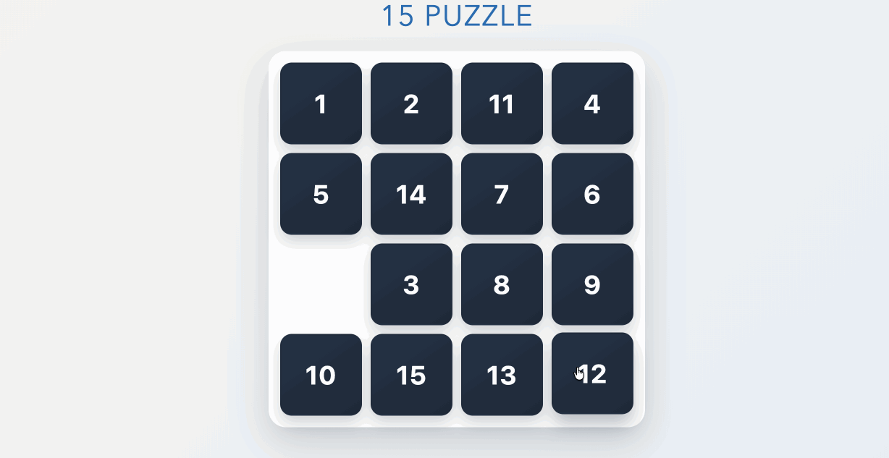

# 15_Game

Classic 15-puzzle built with React. I built this before AI was a thing as part of an interview and it really itched my programming itch. I've since then cleaned up the CSS, updated the packages and fixed the documentation.

## Getting Started

In the project directory, you can run:

### `npm install`
Installs dependencies.

### `npm start`
Runs the app in development mode.

Open [http://localhost:3000](http://localhost:3000) to view it in the browser.

The page will reload if you make edits.

### `npm test -- --watchAll=false`
Runs the test suite once.

## Live Demo
Currently hosted at http://tylerdross.com/15_Game
